Following is the supplementary material for the article "Foundations of Prescriptive Process Monitoring" by [Irene Teinemaa](https://scholar.google.nl/citations?user=UQZ22uQAAAAJ&hl=en&oi=ao), [Niek Tax](https://scholar.google.com.au/citations?user=XkRvCC4AAAAJ&hl=en&oi=ao), [Massimiliano de Leoni](http://www.win.tue.nl/~mdeleoni/), [Marlon Dumas](http://kodu.ut.ee/~dumas/), and [Fabrizio Maria Maggi](https://scholar.google.nl/citations?user=Jo9fNKEAAAAJ&hl=en&oi=sra), which is currently under submission at the [16th International Conference on Business Process Management](http://bpm2018.web.cse.unsw.edu.au/)

The code provided in this repository implements the techniques for alarm-based prescriptive process monitoring.
 Furthermore, the repository provides an implementation of the experimental setus and can be used to investigate:
 * The effect of different cost models on the benefit of an alarm-based prescriptive process monitoring system.
 * The effect of different alarming strategies on the performance of the alarm-based prescriptive process monitoring system.
 * The effect of different probabilistic classification algorithms on the performance of the alarm-based prescriptive process monitorring system.
The code itself can be accessed through https://github.com/TaXxER/AlarmBasedProcessPrediction.

An alarm-based prescriptive process monitoring (short: alarm system) entails two components: 1) a classifier that outputs the likelihood of an undesired outcome for a given (partial) trace of a business process instance and 2) an alarming mechanism that decides whether to raise an alarm based on the classifier's output or not. 
The scripts in this repository train either a [Random Forest (RF)](http://scikit-learn.org/stable/modules/generated/sklearn.ensemble.RandomForestClassifier.html) or a [Gradient Boosted Trees (GBT)](http://lightgbm.readthedocs.io/en/latest/Python-API.html) classifier using the data about historical, i.e. completed process instances. Then, as a particular instantiation of the alarming mechanism, an optimal alarming threshold is found using the Tree-structured Parzen Estimator (TPE) [(link)](https://github.com/hyperopt/hyperopt/wiki) optimization procedure.
The alarm system is evaluated on running, i.e. incomplete instances over different configurations of the cost model.

<!---
## Reference
If you use the code from this repository, please cite the original paper:
```
@article{Teinemaa2018,
  title={Foundations of Prescriptive Process Monitoring },
  author={Teinemaa, Irene and Tax, Niek and de Leoni, Massimiliano and Dumas, Marlon and Maggi, Fabrizio Maria},
  journal={arXiv},
  year={2018}
}
```
--->

## Requirements   
The code is written in Python 3.6. Although not tested, it should work with any version of Python 3. Additionally, the following Python libraries are required to run the code: 

* sklearn
* numpy
* pandas
* lightgbm
* hyperopt

## Usage
#### Data format
The tool assumes the input is a complete log of all traces in the CSV format, each row representing one event in a trace, wherein each event is associated with at least the following attributes (as columns in the CSV file): the case id, activity type, timestamp, class label. As additional columns, any number of event and case attributes is accepted that are used to enhance the predicitve power of the classifier. The relevant columns should be specified in the script `dataset_confs.py`.

The input log is temporally split into data for building (80% of cases) and evaluating (20% of cases) the alarm system. The data for building the alarm system is further split (via random sampling) into a dataset for training the classifier (64% of all cases in the event log) and a dataset for optimizing the alarming threshold (16% of all cases in the event log). On the evaluation set the tool evaluates the obtained cost/benefit of processing a trace using the alarm system, given a particular configuration of the cost model. 

#### Building the alarm system
The alarm system can be tuned and built by following these 3 steps:

**1. Optimizing the classifier's hyperparameters.**

`python optimize_params_<classifier>.py <dataset_name> <output_dir>`   

These scripts use the training data (64% of cases in the whole dataset) to optimize the hyperparameters of the classifier (either _rf_ or _lgbm_) via 3-fold cross validation. 
The arguments to the scripts are: 

* _dataset_name_ - the name of the dataset, should correspond to the settings specified in `dataset_confs.py`;
* _output_dir_ - the name of the directory where the optimal parameters will be written.

**2. Training the final classifier and writing the predictions.**

`python write_<classifier>_predictions.py <dataset_name> <optimal_params_file> <output_dir>`  
 
These scripts use the training data (64% of cases in the whole dataset) to train the final classifier (either _rf_ or _lgbm_) using the previously optimized hyperparameters (from step 1).

The arguments to the scripts are: 

* _dataset_name_ - the name of the dataset, should correspond to the settings specified in `dataset_confs.py`;
* _optimal_params_file_ - the file where the optimized hyperparameter values can be found (from step 1);
* _output_dir_ - the name of the directory where the final predictions will be written.

**3. Optimizing the alarming threshold.**

`python optimize_threshold.py <dataset_name> <predictions_dir> <output_dir>`  

`python optimize_threshold_effectiveness.py <dataset_name> <predictions_dir> <output_dir>`  

`python optimize_threshold_compensation.py <dataset_name> <predictions_dir> <output_dir>`  
 
These scripts use the thresholding data (16% of cases in the whole dataset) to find the optimal alarming threshold for different configurations of the cost model. In particular, the first script (corresponds to RQ1 in the paper) varies the ratio between the _cost of the undesired outcome_ and the _cost of the intervention_, while keeping other parameters of the cost model unchanged. The second script varies both 1) the same ratio and 2) the _mitigation effectiveness of the intervention_ (RQ2). The third script varies two ratios: 1) between the _cost of the undesired outcome_ and the _cost of the intervention_ and 2) between the _cost of the intervention_ and the _cost of compensation_ (RQ3).

The arguments to the scripts are: 

* _dataset_name_ - the name of the dataset, should correspond to the settings specified in `dataset_confs.py`;
* _predictions_dir_ - the name of the directory where the final predictions have been written (from step 2)
* _output_dir_ - the name of the directory where the optimal alarming thresholds will be written.

#### Evaluation
**1. Testing the optimized threshold.**

`python test_optimized_thresholds.py <dataset_name> <predictions_dir> <optimal_thresholds_dir> <output_dir>`

`python test_optimized_thresholds_effectiveness.py <dataset_name> <predictions_dir> <optimal_thresholds_dir> <output_dir>`

`python test_optimized_thresholds_compensation.py <dataset_name> <predictions_dir> <optimal_thresholds_dir> <output_dir>`   

These scripts use the test data (the latest 20% of cases in the whole dataset) to evaluate the alarm system given the optimized alarming threshold over different configurations of the cost model. In particular, the first script (corresponds to RQ1 in the paper) varies the ratio between the _cost of the undesired outcome_ and the _cost of the intervention_, while keeping other parameters of the cost model unchanged. The second script varies both the same ratio, but also the _mitigation effectiveness of the intervention_ (RQ2). The third script varies two ratios: 1) between the _cost of the undesired outcome_ and the _cost of the intervention_ and 2) between the _cost of the intervention_ and the _cost of compensation_ (RQ3).

The arguments to the scripts are: 

* _dataset_name_ - the name of the dataset, should correspond to the settings specified in `dataset_confs.py`;
* _predictions_dir_ - the name of the directory where the final predictions have been written (from step 2 in the alarm system building phase)
* _optimal_thresholds_dir_ - the name of the directory where the optimal alarming thresholds have been written (from step 3 in the alarm system building phase)
* _output_dir_ - the name of the directory where the results of the evaluation will be written.

**2. Testing fixed thresholds (baselines).**

`python test_fixed_thresholds.py <dataset_name> <predictions_dir> <output_dir>`

This script uses the test data (the latest 20% of cases in the whole dataset) to evaluate the alarm system on several fixed, i.e. non-optimized thresholds over different configurations of the cost model. In particular, the script varies the ratio between the _cost of the undesired outcome_ and the _cost of the intervention_, while keeping other parameters of the cost model unchanged (corresponds to RQ1 in the paper). The script outputs results for thresholds 0, 0.1, ..., 1.1, where threshold 0 corresponds to alarming always after the first event and threshold 1.1 corresponds to never alarming (the _as-is_ system).

The arguments to the script are: 

* _dataset_name_ - the name of the dataset, should correspond to the settings specified in `dataset_confs.py`;
* _predictions_dir_ - the name of the directory where the final predictions have been written (from step 2 in the alarm system building phase)
* _output_dir_ - the name of the directory where the results of the evaluation will be written.

## Supplementary figures
Here we present the results of the evaluation that were not included in the paper due to the page limit.

**Cost over different ratios of the _cost of the undesired outcome_ and the _cost of the intervention_ (Gradient Boosted Trees) - corresponds to Fig. 1 in the paper:**

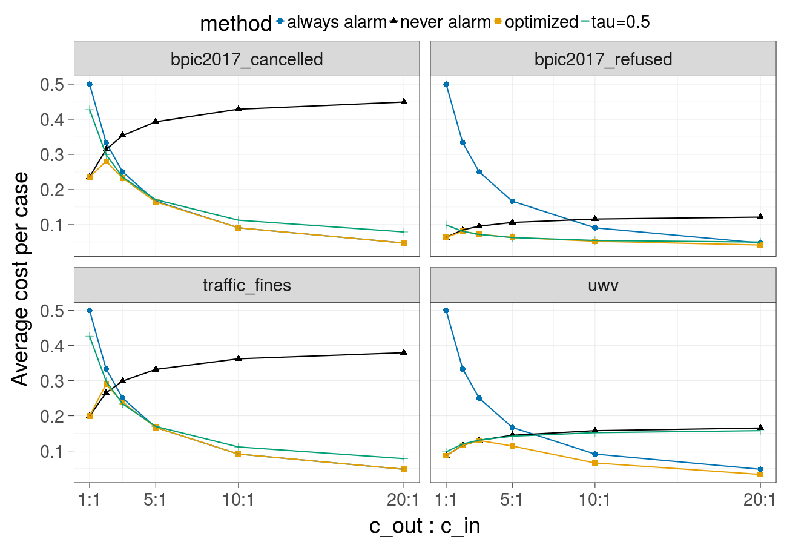

**Cost over different ratios of the _cost of the undesired outcome_ and the _cost of the intervention_ (Random forest):**

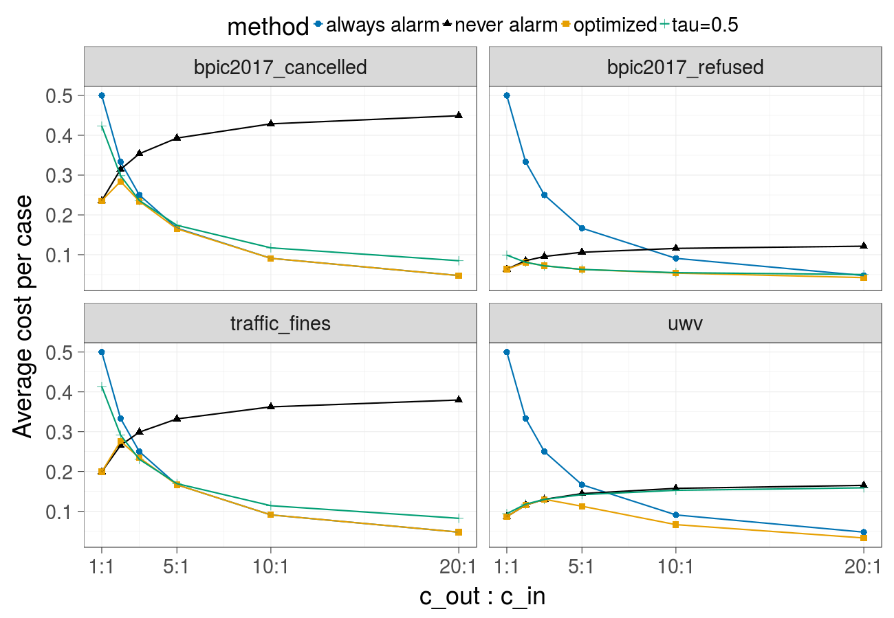

**Cost over different thresholds (Gradient Boosted Trees) - corresponds to Fig. 2 in the paper:**

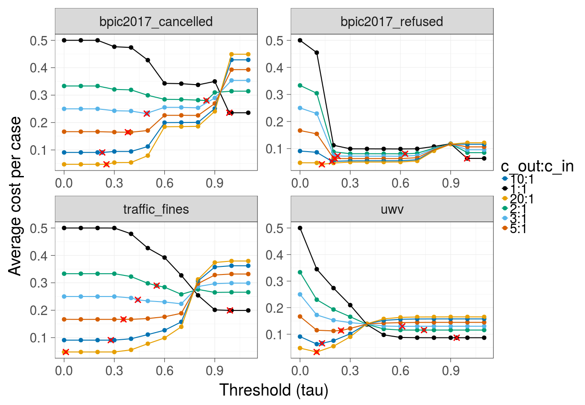

**Cost over different thresholds (Random forest):**


**Earliness and F-score over different ratios of the _cost of the undesired outcome_ and the _cost of the intervention_ (Gradient Boosted Trees):**

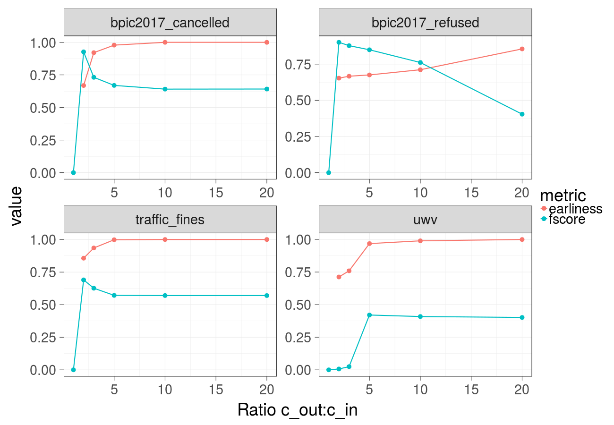

**Earliness and F-score over different ratios of the _cost of the undesired outcome_ and the _cost of the intervention_ (Random forest):**

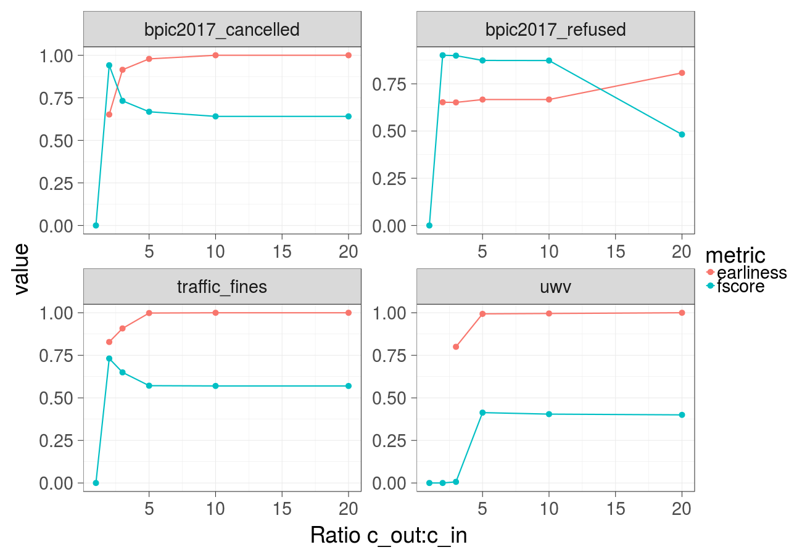

**Cost over different _mitigation effectiveness_ values (constant over time) and ratios of the _cost of the undesired outcome_ and the _cost of the intervention_ (Gradient Boosted Trees) - extended version of Fig. 3a in the paper:**

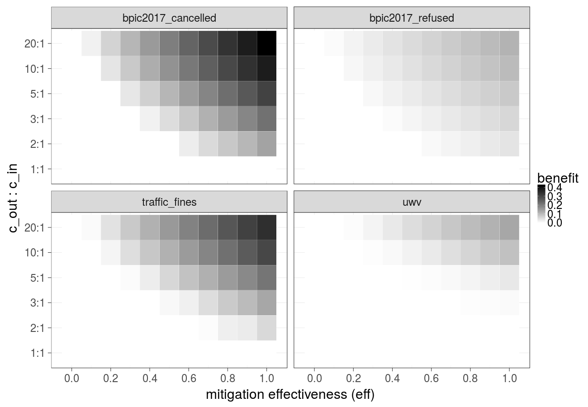

**Cost over different _mitigation effectiveness_ values (constant over time) and ratios of the _cost of the undesired outcome_ and the _cost of the intervention_ (Random forest):**


**Cost over different _mitigation effectiveness_ values (linear decay) and ratios of the _cost of the undesired outcome_ and the _cost of the intervention_ (Gradient Boosted Trees):**

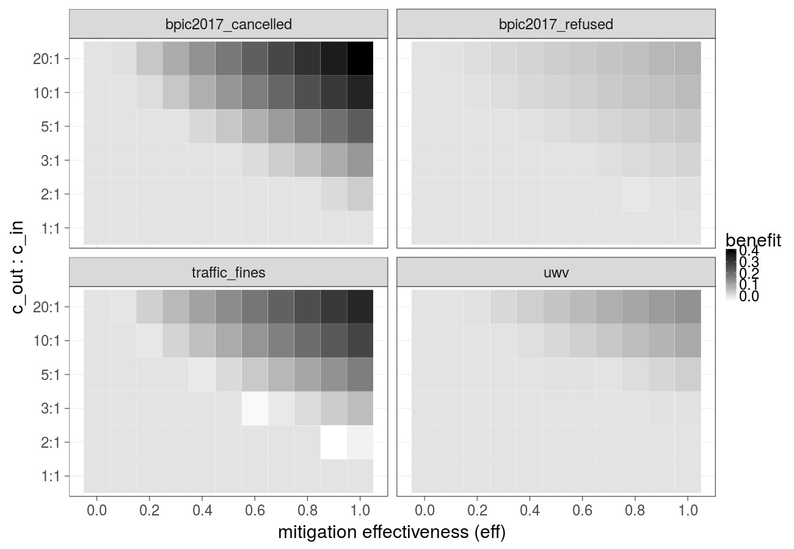

**Cost over different _mitigation effectiveness_ values (linear decay) and ratios of the _cost of the undesired outcome_ and the _cost of the intervention_ (Random forest):**


**Cost over different ratios of 1) the _cost of the undesired outcome_ and the _cost of the intervention_ and 2) the _cost of the intervention_ and the _cost of compensation_, _cost of the intervention_ is constant over time (Gradient Boosted Trees) - extended version of Fig. 3b in the paper:**

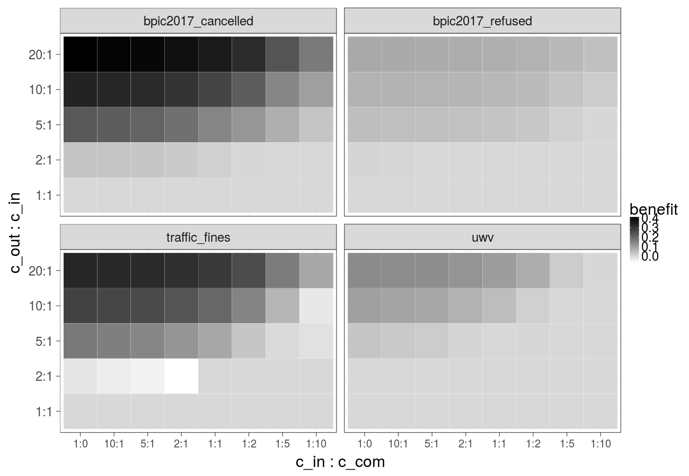

**Cost over different ratios of 1) the _cost of the undesired outcome_ and the _cost of the intervention_ and 2) the _cost of the intervention_ and the _cost of compensation_, _cost of the intervention_ is constant over time (Random forest):**

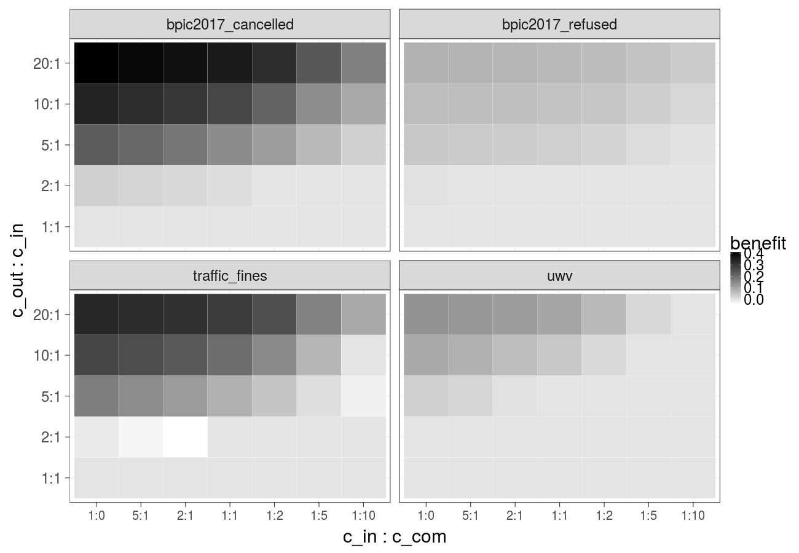

**Cost over different ratios of 1) the _cost of the undesired outcome_ and the _cost of the intervention_ and 2) the _cost of the intervention_ and the _cost of compensation_, _cost of the intervention_ is increasing linearly (Gradient Boosted Trees):**


**Cost over different ratios of 1) the _cost of the undesired outcome_ and the _cost of the intervention_ and 2) the _cost of the intervention_ and the _cost of compensation_, _cost of the intervention_ is increasing linearly (Random forest):**

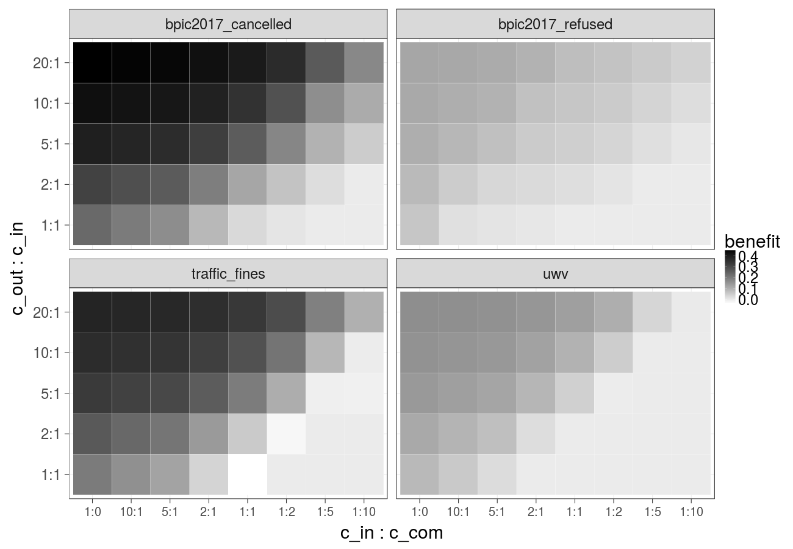

**Reliability plot (bpic2017_refused, Gradient Boosted Trees). The proportion of actual positive samples in the dataset is plotted against the proportion of samples assigned a likelihood score in a given range, each subfigure corresponds to a given prefix length. A perfectly calibrated classifier (i.e. the scores assigned correspond to probabilities) would output scores in the diagonal line. We observe that calibration using Platt Scaling (pink lines) does not improve the predicted probabilities as compared to the original scores (blue lines):**

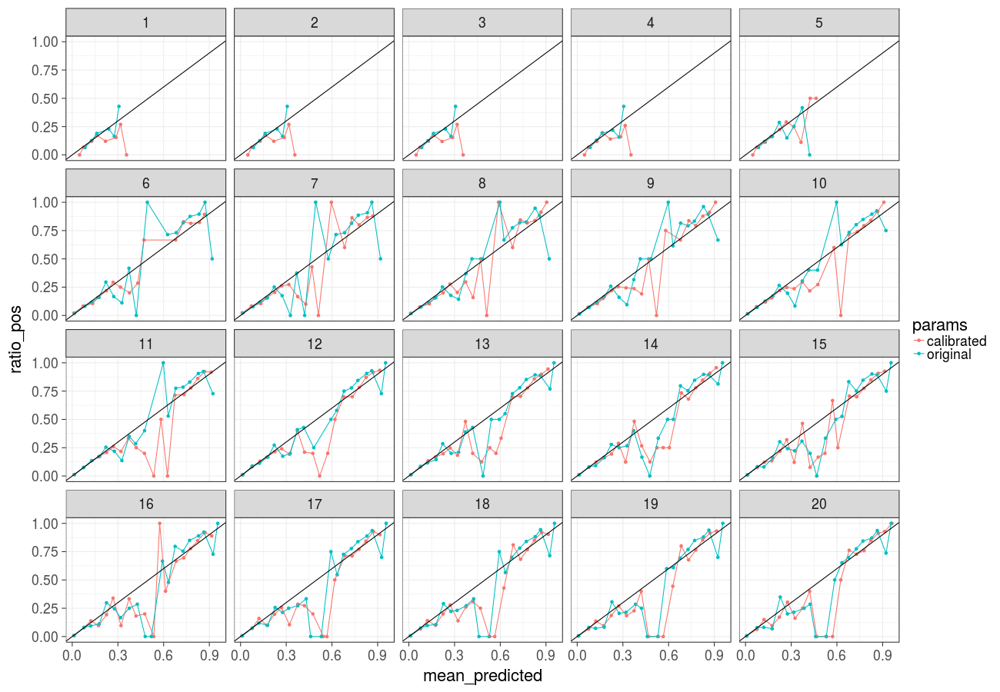
